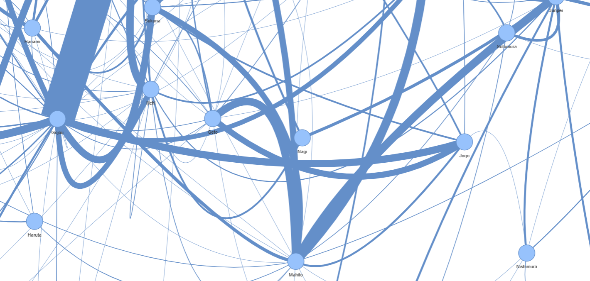

<h1>Jujutsu Kaisen Season 1 Transcript Analysis</h1>

This repository contains an <strong>NLP (Natural Language Processing) project</strong> that focuses on the analysis of the transcript of <strong>Jujutsu Kaisen Season 1</strong> episodes. The main objectives of this project are:

<ol>
  <li><strong>Dialogue Analysis</strong>: The project analyzes the amount of dialogue each character has throughout the season. This provides insights into the prominence and involvement of each character in the storyline.</li>
  <li><strong>Relationship Analysis</strong>: The project also investigates the relationships between the characters. This is achieved by examining the interactions and dialogues between different characters.</li>
</ol>

The transcript used for this analysis is sourced from <a href="https://www.opensubtitles.org/pl/pl">OpenSubtitles</a>.

Example connections between characters, the thicker the line, the greater the relationship between these characters.

### Image 

